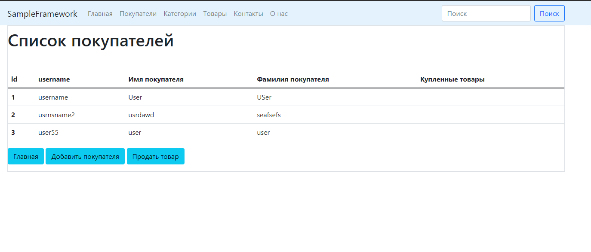
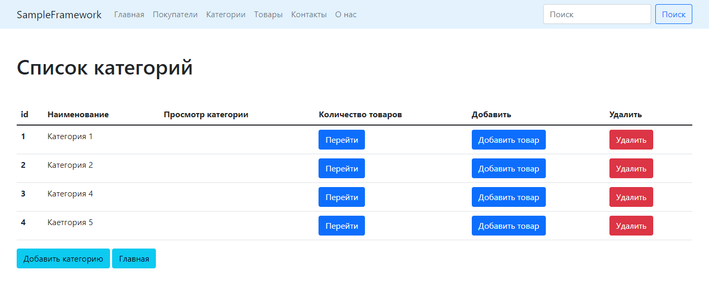

# Итоговый проект по курсу "Архитектура и шаблоны проектирования на Python"
___
## Проект представляет собой простой аналог фреймворка Django
 
___
### Цель проекта: 
    На практике понять как строиться архитектура Python приложения. 
    При проектировании использованы: Паттерны web-представления, Порождающие, Структурные и Поведенческие паттерны
___
### Функционал проекта:
    * Разработан MVC, Page и Front контроллеры
    * Разработан паттерн 'Абстрактная фабрика и Фабричный метод' интерфейсы создающий абстрактные 
    объекты Категорий, Продуктов и Пользователей
    * Разработан функционал фреймворка с использованием структурных паттерннов:
      - декоратор 'Debug' для организации логирования 
      - декоратор 'Route' для организации маршрутизации
    * Разработан функционал фреймворка с использованием поведенческих паттернов:
      - разработанны классы представления по аналогии CBV в Django
    * Разработан функционал фреймворка с использованием архитектурных паттернов:
      - разработан класс-маппер для организации взаимодействия с базой данных
      - разработан класс UnitOfWork - отслеживает изменения данных и запускает изменения в БД
___
## Запуск проекта:
1. Клонировать репозиторий `https://github.com/basterrus/Sample_framework.git` 
2. Перейти (при необходимости) в папку с фреймворком `cd Sample_framework`
3. Выполнить команду `python runner.py `